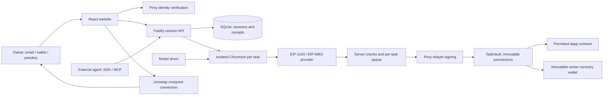

# Architecture

## Wallet roles

The owner authenticates with Privy and owns the recovery address. A separate Privy-managed relayer signs outer Ethereum transactions and pays their gas. A task vault is a Solidity contract holding only that task's funds/assets. Dapps see the vault address through an injected provider. They never receive the owner's provider, cookies, private key or the relayer's signing credentials.

The relayer calls `TaskVault.execute(target,value,data)`. The vault calls the dapp, so the dapp sees the vault as `msg.sender`. A resulting NFT therefore belongs to the vault until recovery. The provider returns the actual outer transaction hash; consumers must understand that the outer sender is the relayer. This is a narrow contract-account provider, not an EOA impersonator. If the owner set a contract lock, only that function is permitted. If they did not, any call inside the native budget is permitted except known approval and transfer selectors.

## Lifecycle

`funding → ready → running ⇄ paused → closing → closed`

Failures can enter `attention`. Closing first blocks server signing, waits for queued submitted work to reconcile, closes access onchain, then attempts asset and native recovery independently. A failed token transfer cannot keep onchain execution open. Transactions already submitted cannot be cancelled by closing the browser. Expiry prevents new execution in Solidity even when the API is offline; returning assets still requires a transaction.

On restart, running, paused and closing sessions enter `attention`. They are never silently resumed. Pending hashes are checked before recovery. Refund totals are rebuilt from confirmed `Recovered` logs. Known ERC-20/ERC-721 arrivals are detected from confirmed execution receipt logs. Late assets can be registered by the owner, and native funds checked again after closure.

## Persistence and concurrency

SQLite WAL stores task snapshots, auth-session hashes, API-key hashes, idempotency mappings and relayer/fixture metadata. Per-task promise queues serialize executions/recovery; one relayer queue serializes outer submissions. This design assumes **one process**. Creation persists intent before deployment and saves submitted hashes before confirmation. Idempotency keys are scoped to the authenticated owner and reject changed request bodies.

A crash after a provider accepted a transaction but before its hash was received/persisted is still an ambiguous submission window. Do not automatically replay it. Inspect the relayer's chain/provider history. This implementation does not claim exactly-once submission across all external failures.

## Driver and UI

The model sees visible controls, page text and the last eight actions. It chooses click, fill, wait or finish; it does not construct transactions or decide its own allowance. There are 30 steps per run, a 45-second model timeout, and 20 submitted dapp transactions per task. Each execution has a one-million-gas limit. Native spending limits are also enforced onchain.

The preview is an authenticated, periodically refreshed screenshot. Manual control uses indexed DOM controls from the most recent observation, rather than pretending the screenshot is a low-latency remote desktop. The custom wallet sleeve reflects session state, the ribbon represents remaining allowance, and decorative motion honours reduced-motion and viewport/document visibility.
